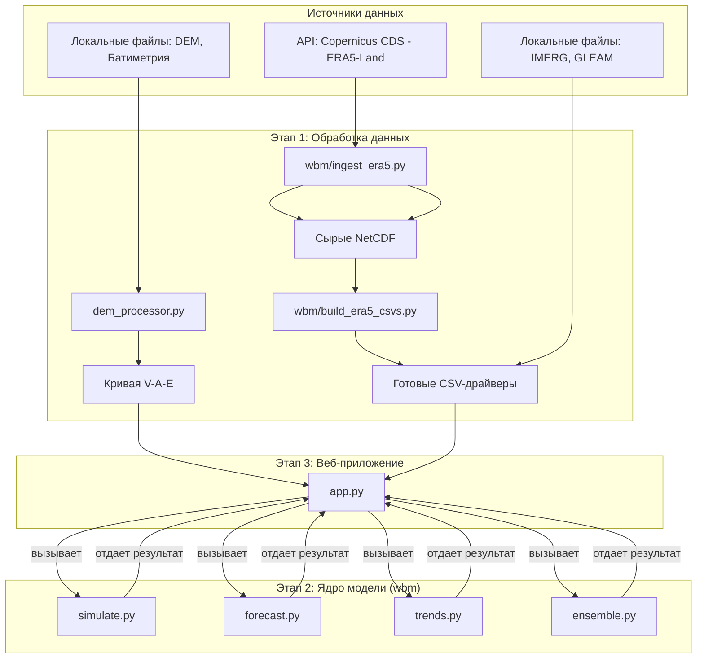

# Технический Обзор и Документация Проекта: Интерактивная Модель Водного Баланса

**Версия 1.0**
**Дата:** 04.09.2025

**Оглавление:**
1.  [Введение](#введение)
    *   [1.1. Цели и Задачи Проекта](#цели-и-задачи-проекта)
    *   [1.2. Обзор для Инвесторов](#обзор-для-инвесторов)
    *   [1.3. Целевая Аудитория](#целевая-аудитория)
2.  [Архитектура Системы](#архитектура-системы)
    *   [2.1. Общая Схема](#общая-схема)
    *   [2.2. Технологический Стек](#технологический-стек)
3.  [Источники Данных (Drivers)](#источники-данных-drivers)
    *   [3.1. Спутниковые Данные об Осадках (IMERG)](#спутниковые-данные-об-осадках-imerg)
    *   [3.2. Данные об Эвапотранспирации (GLEAM)](#данные-об-эвапотранспирации-gleam)
    *   [3.3. Климатические Данные (ERA5-Land)](#климатические-данные-era5-land)
    *   [3.4. Данные о Рельефе и Глубинах (Bathymetry/DEM)](#данные-о-рельефе-и-глубинах-bathymetrydem)
4.  [Сбор и Обработка Данных](#сбор-и-обработка-данных)
    *   [4.1. Обработка DEM и Батиметрии (`dem_processor.py`)](#обработка-dem-и-батиметрии-dem_processorpy)
    *   [4.2. Загрузка Данных ERA5-Land (`wbm/ingest_era5.py`)](#загрузка-данных-era5-land-wbmingest_era5py)
    *   [4.3. Агрегация Данных ERA5-Land (`wbm/build_era5_csvs.py`)](#агрегация-данных-era5-land-wbmbuild_era5_csvspy)
    *   [4.4. Загрузка Спутниковых Снимков Sentinel-2 (`wbm/ingest_sentinel.py`)](#загрузка-спутниковых-снимков-sentinel-2-wbmingest_sentinelpy)
    *   [4.5. Структура хранилища данных (`wbm/storage`) и изменения](#структура-хранилища-данных-wbmstorage-и-изменения)
5.  [Ядро Модели Водного Баланса (Пакет `wbm`)](#ядро-модели-водного-баланса-пакет-wbm)
    *   [5.1. Модуль Симуляции (`wbm/simulate.py`)](#модуль-симуляции-wbmsimulatepy)
    *   [5.2. Модуль Данных (`wbm/data.py`)](#модуль-данных-wbmdatapy)
    *   [5.3. Модуль Кривых (`wbm/curve.py`)](#модуль-кривых-wbmcurvepy)
    *   [5.4. Модуль Прогнозирования (`wbm/forecast.py`)](#модуль-прогнозирования-wbmforecastpy)
    *   [5.5. Модуль Анализа Трендов (`wbm/trends.py`)](#модуль-анализа-трендов-wbmtrendspy)
    *   [5.6. Модуль Ансамблевого Прогнозирования (`wbm/ensemble.py`)](#модуль-ансамблевого-прогнозирования-wbmensemblepy)
    *   [5.7. Вспомогательные Модули (`analysis.py`, `plots.py`)](#вспомогательные-модули-analysispy-plotspy)
    *   [5.8. Валидация (ретроспективная) (`wbm/validation.py`)](#валидация-ретроспективная-wbmvalidationpy)
6.  [Веб-приложение (Streamlit)](#веб-приложение-streamlit)
    *   [6.1. Структура Приложения (`app.py`)](#структура-приложения-apppy)
    *   [6.2. Пользовательский Интерфейс и Управление](#пользовательский-интерфейс-и-управление)
    *   [6.3. Визуализация Данных](#визуализация-данных)
7.  [Развертывание и Конфигурация](#развертывание-и-конфигурация)
    *   [7.1. Системные Требования (`requirements.txt`)](#системные-требования-requirementstxt)
    *   [7.2. Руководство по Развертыванию (`DEPLOYMENT.md`)](#руководство-по-развертыванию-deploymentmd)
8.  [Заключение и Дальнейшие Шаги](#заключение-и-дальнейшие-шаги)
    *   [8.1. Ключевые Результаты](#ключевые-результаты)
    *   [8.2. Потенциальные Улучшения](#потенциальные-улучшения)
9.  [Приложения](#приложения)
    *   [A. Каталог модельных данных (схемы и единицы)](#a-каталог-модельных-данных-схемы-и-единицы)
    *   [B. Обзор UI-модулей (wbm/ui/*)](#b-обзор-ui-модулей-wbmui)

---

## 1. Введение

### 1.1. Цели и Задачи Проекта

Основная цель данного проекта — разработка интерактивной веб-модели для анализа и прогнозирования водного баланса водохранилища. Система предназначена для решения следующих ключевых задач:

*   **Агрегация Разнородных Данных:** Сбор и унификация данных из различных источников, включая спутниковые наблюдения (осадки, эвапотранспирация), климатические реанализы (температура, сток, снегозапасы) и локальные батиметрические измерения.
*   **Моделирование Водного Баланса:** Реализация математической модели, позволяющей симулировать изменение объема и площади водной поверхности водохранилища на основе входящих и исходящих потоков (осадки, испарение, приток/отток).
*   **Сценарный Анализ:** Предоставление пользователям возможности исследовать различные гипотетические сценарии ("что, если?") путем изменения ключевых параметров модели, таких как интенсивность осадков и испарения.
*   **Прогнозирование:** Создание краткосрочных и долгосрочных прогнозов состояния водохранилища с использованием различных методов, от простой климатологии до сложных моделей, учитывающих сезонность и долгосрочные тренды.
*   **Визуализация и Интерпретация:** Обеспечение интуитивно понятного веб-интерфейса для визуализации временных рядов, карт, трендов и статистических показателей, что делает сложную гидрологическую информацию доступной для широкого круга пользователей.
*   **Оценка Неопределенности:** Внедрение ансамблевого моделирования для оценки диапазона возможных будущих состояний водоема, что является критически важным для принятия взвешенных решений в условиях климатической изменчивости.

### 1.2. Обзор для Инвесторов

Данный проект представляет собой цифровой инструмент стратегического планирования и управления водными ресурсами. В условиях растущей климатической нестабильности, точное прогнозирование и моделирование состояния водных объектов, таких как водохранилища, становится не просто научной задачей, а ключевым элементом экономической и экологической безопасности.

**Ключевая ценность продукта:**

1.  **Снижение рисков:** Наша модель позволяет предвидеть потенциальные проблемы, связанные с дефицитом или избытком воды, давая возможность заблаговременно разработать стратегии реагирования. Это напрямую влияет на стабильность сельского хозяйства, промышленности и энергетики в регионе.
2.  **Оптимизация ресурсов:** Инструмент помогает принимать обоснованные решения по управлению стоком, сбросами и использованием воды, максимизируя экономическую выгоду и минимизируя экологический ущерб.
3.  **Автоматизация и скорость:** Вместо ручного сбора и анализа данных, который может занимать недели, наша система предоставляет актуальную информацию и прогнозы в режиме реального времени. Это на порядки ускоряет цикл принятия решений.
4.  **Масштабируемость:** Архитектура проекта позволяет относительно легко адаптировать модель для других водохранилищ или водных систем, открывая широкие возможности для коммерциализации и расширения.

Проект объединяет передовые научные подходы (гидрологическое моделирование, анализ временных рядов) с современными технологиями (обработка спутниковых данных, веб-разработка). Это не просто "еще одно приложение с графиками", а мощная аналитическая платформа, способная стать незаменимым помощником для государственных регуляторов, агропромышленных холдингов, энергетических компаний и международных организаций.

### 1.3. Целевая Аудитория

Продукт ориентирован на несколько групп пользователей:

*   **Технические специалисты (гидрологи, инженеры, аналитики данных):** Используют платформу для глубокого анализа, валидации моделей, детального изучения данных и подготовки технических отчетов. Для них важна точность, гибкость настроек и прозрачность работы модели.
*   **Менеджеры и лица, принимающие решения (ЛПР):** Используют дашборды и итоговые прогнозы для стратегического планирования, оценки рисков и принятия управленческих решений. Для них важны наглядность, простота интерпретации и ключевые выводы.
*   **Научные сотрудники и исследователи:** Используют платформу для изучения климатических трендов, валидации собственных гипотез и как источник обработанных, готовых к анализу данных.

---

## 2. Архитектура Системы

### 2.1. Общая Схема

Система построена по модульному принципу, что обеспечивает гибкость и масштабируемость. Работу системы можно разделить на три основных этапа:

1.  **Сбор и предварительная обработка данных (Data Ingestion & Processing):**
    *   Скрипты (`dem_processor.py`, `wbm/ingest_era5.py`, `wbm/build_era5_csvs.py`) отвечают за загрузку "сырых" данных из различных источников (локальные файлы, API).
    *   Данные проходят через конвейер обработки: репроекция, усреднение по области интереса (AOI), агрегация по времени (например, из почасовых в суточные), очистка и сохранение в унифицированном формате (CSV).
    *   На этом этапе формируются ключевые "драйверы" модели — временные ряды осадков, испарения, температуры и т.д.

2.  **Ядро моделирования (Core Modeling Engine):**
    *   Центральный компонент системы, реализованный в пакете `wbm`.
    *   Модуль `simulate.py` выполняет пошаговый расчет водного баланса.
    *   Модули `forecast.py`, `trends.py`, `ensemble.py` предоставляют различные методы для построения прогнозов.
    *   Модуль `curve.py` отвечает за физические характеристики водоема (связь между объемом, площадью и уровнем).

3.  **Пользовательский интерфейс (Frontend Application):**
    *   Скрипт `app.py` представляет собой интерактивное веб-приложение, созданное с помощью фреймворка Streamlit.
    *   Он загружает обработанные данные и результаты моделирования.
    *   Предоставляет пользователю элементы управления (слайдеры, переключатели, поля ввода) для настройки сценариев.
    *   Динамически вызывает функции из ядра моделирования для пересчета прогнозов.
    *   Визуализирует результаты в виде интерактивных графиков, карт и таблиц.

**Схема потоков данных:**



### 2.2. Технологический Стек

*   **Язык программирования:** Python 3.10+
*   **Основные библиотеки для анализа данных:**
    *   **Pandas:** Основа для работы с временными рядами и табличными данными.
    *   **NumPy:** Для эффективных численных вычислений.
    *   **Xarray:** Для работы с многомерными массивами данных (NetCDF), особенно актуально для климатических данных.
    *   **Scipy:** Используется для научных вычислений, в частности для интерполяции и статистических тестов (например, тренд Теила-Сена).
*   **Библиотеки для работы с геоданными:**
    *   **Rasterio:** Ключевой инструмент для чтения, записи и обработки растровых геоданных (DEM, спутниковые снимки).
    *   **Shapely:** Для работы с векторными геометрическими объектами.
*   **Веб-фреймворк:**
    *   **Streamlit:** Позволяет быстро создавать интерактивные веб-приложения для анализа данных на чистом Python.
*   **Визуализация:**
    *   **Plotly:** Используется для создания интерактивных, высококачественных графиков и диаграмм.
    *   **Matplotlib:** Применяется для статических графиков, например, при первичной обработке данных.
*   **Взаимодействие с API:**
    *   **cdsapi:** Официальный клиент для доступа к данным Copernicus Climate Data Store.

---

## 3. Источники Данных (Drivers)

"Драйверами" в контексте данной модели называются внешние временные ряды, которые определяют гидрологические и климатические условия для водохранилища. Качество и разрешение этих данных напрямую влияют на точность моделирования и прогнозирования. Система гибко поддерживает несколько источников данных, позволяя проводить сравнение и выбирать наиболее подходящий набор для конкретной задачи.

### 3.1. Спутниковые Данные об Осадках (IMERG)

*   **Источник:** IMERG (Integrated Multi-satellitE Retrievals for GPM) — это глобальный продукт NASA, который предоставляет оценки осадков с высоким пространственным и временным разрешением. Он комбинирует данные с множества спутников для создания единой, консистентной картины осадков по всему миру.
*   **Роль в проекте:** IMERG используется как один из основных источников данных об осадках (`precipitation_mm`). Эти данные являются ключевым входящим потоком в уравнении водного баланса.
*   **Формат данных:** В проекте используются предварительно обработанные данные, сохраненные в файле `precipitation_timeseries.csv`. Исходные данные, вероятно, имели почасовое разрешение (`mean_precip_mm_per_h`), которые затем агрегируются в суточные значения (мм/день) при загрузке в приложении.
*   **Преимущества:** Глобальное покрытие, высокая частота обновления.
*   **Ограничения:** Как и все спутниковые продукты, может содержать погрешности, особенно в регионах со сложным рельефом или в зимний период.

### 3.2. Данные об Эвапотранспирации (GLEAM)

*   **Источник:** GLEAM (Global Land Evaporation Amsterdam Model) — это набор данных, фокусирующийся на расчете эвапотранспирации (суммарного испарения с поверхности суши и растений) на основе спутниковых наблюдений.
*   **Роль в проекте:** GLEAM предоставляет данные об испарении (`evaporation_mm`), которые являются основным исходящим потоком в водном балансе.
*   **Формат данных:** Аналогично IMERG, используются данные из агрегированного файла `gleam_summary_all_years.csv`. Ключевая переменная — `E` (мм/день).
*   **Преимущества:** Специализированная модель, учитывающая множество факторов, влияющих на испарение (радиация, температура, влажность почвы).
*   **Ограничения:** Модель имеет свои допущения и может отличаться от фактического испарения с открытой водной поверхности, что может потребовать калибровки или использования масштабных коэффициентов.

### 3.3. Климатические Данные (ERA5-Land)

*   **Источник:** ERA5-Land — это климатический реанализ от Европейского центра среднесрочных прогнозов погоды (ECMWF), предоставляющий детальную информацию о состоянии суши по всему миру с 1950 года по настоящее время. Это результат комбинирования моделирования с огромным количеством наблюдательных данных.
*   **Роль в проекте:** ERA5-Land выступает как комплексный и внутренне согласованный источник данных, который может заменить связку IMERG+GLEAM. Он предоставляет не только осадки и испарение, но и другие важные переменные:
    *   **Total Precipitation (tp):** Суммарные осадки.
    *   **Total Evaporation (e):** Суммарное испарение (в модели ERA5 имеет отрицательный знак, который инвертируется при обработке).
    *   **Runoff (ro):** Поверхностный и подповерхностный сток. Может использоваться как дополнительный приточный компонент.
    *   **2m Temperature (t2m):** Температура воздуха на высоте 2 метра. Используется для анализа трендов и визуализации.
    *   **Snow Water Equivalent (swe):** Эквивалент водяного столба в снежном покрове. Важный параметр, который может быть включен в расчет осадков для учета таяния снега.
*   **Процесс получения данных:** Система включает полноценный конвейер для работы с ERA5-Land:
    1.  `wbm/ingest_era5.py`: Скрипт для загрузки сырых почасовых данных в формате NetCDF с серверов Copernicus (CDS API) для заданной области (bbox) и периода.
    2.  `wbm/build_era5_csvs.py`: Скрипт для обработки скачанных NetCDF файлов. Он выполняет пространственное усреднение по области интереса, временную агрегацию (суммирование для потоков, усреднение для состояний) для получения суточных значений и конвертацию единиц (например, из метров в миллиметры для потоков, из Кельвинов в Цельсии для температуры).
*   **Преимущества:** Физическая согласованность между переменными, высокое разрешение, длинный исторический период.
*   **Ограничения:** Требует значительных вычислительных ресурсов для загрузки и обработки.

### 3.4. Данные о Рельефе и Глубинах (Bathymetry/DEM)

*   **Источник:** Данные состоят из двух частей:
    1.  **Локальная батиметрия (`bathymetry_hh.tif`):** Карта глубин самого водохранилища, полученная, вероятно, в результате полевых измерений. Это наиболее точные данные о подводном рельефе.
    2.  **Copernicus DEM (`output_hh.tif`):** Цифровая модель рельефа (ЦМР) окружающей местности.
*   **Роль в проекте:** Эти данные являются фундаментом для понимания физических характеристик водохранилища. Скрипт `dem_processor.py` использует их для:
    *   **Интеграции:** Создания единой, бесшовной модели рельефа, объединяя точную батиметрию с ЦМР окружающей территории.
    *   **Построения кривых "Площадь-Объем-Уровень":** Расчета ключевых зависимостей, которые показывают, как изменяется площадь водной поверхности и уровень воды при изменении объема. Эти кривые (`area_volume_curve.csv`) являются сердцем физической модели водоема и используются в модуле симуляции для определения площади испарения и площади, на которую выпадают осадки.
*   **Преимущества:** Использование высокоточной локальной батиметрии обеспечивает максимальную достоверность расчетов объема.
*   **Ограничения:** Точность модели напрямую зависит от качества и актуальности исходных батиметрических измерений.

---

## 4. Сбор и Обработка Данных

Этот этап является фундаментальным для всей системы. Его задача — преобразовать разнородные "сырые" данные в унифицированные, готовые к использованию временные ряды (драйверы) и физические модели (кривые).

### 4.1. Обработка DEM и Батиметрии (`dem_processor.py`)

Этот скрипт выполняет одну из самых критически важных задач в проекте — он создает физическую модель водохранилища. Без результата его работы — файла `area_volume_curve.csv` — симуляция невозможна.

**Ключевые функции:**

1.  **Интеграция моделей рельефа:** Скрипт способен объединять два источника данных о рельефе:
    *   **Высокоточная локальная батиметрия (`bathymetry_hh.tif`):** Карта глубин непосредственно самого водоема.
    *   **Глобальная ЦМР (`Copernicus DEM`):** Карта высот окружающей местности.
    Это позволяет создать единую, бесшовную карту высот/глубин для всей интересующей области. Скрипт может использовать порог мелководья (`SHALLOW_THRESHOLD_M`), чтобы корректно сшивать данные на границе водоема.

2.  **Расчет кривой "Площадь-Объем-Уровень":** Это основная задача скрипта. Алгоритм работает следующим образом:
    *   Он итерирует по диапазону уровней воды (от минимальной до максимальной глубины) с заданным шагом (`ELEVATION_STEPS`).
    *   На каждом шаге (для каждого уровня воды) он вычисляет:
        *   **Площадь затопления (Area):** Количество пикселей растра, которые находятся ниже данного уровня воды, умноженное на площадь одного пикселя.
        *   **Объем воды (Volume):** Сумма объемов столбов воды над каждым затопленным пикселем. Объем над пикселем = (уровень воды - глубина пикселя) * площадь пикселя.
    *   Результаты этих вычислений для каждого уровня сохраняются в таблицу.

3.  **Создание маски воды по NDWI:** Скрипт также включает функции для анализа спутниковых снимков Sentinel-2. Он может рассчитывать Нормализованный разностный водный индекс (NDWI), чтобы определить фактическую площадь водной поверхности на определенную дату. Это может использоваться для валидации или уточнения границ водоема.

**Выходной продукт:**

*   **`area_volume_curve.csv`:** Табличный файл, содержащий колонки `elevation_m`, `area_km2`, `volume_mcm`. Этот файл является "паспортом" водохранилища и используется модулем симуляции для определения площади поверхности по известному объему и наоборот.

### 4.2. Загрузка Данных ERA5-Land (`wbm/ingest_era5.py`)

Этот скрипт автоматизирует процесс получения климатических данных с серверов Copernicus.

**Ключевые функции:**

*   **Взаимодействие с CDS API:** Использует библиотеку `cdsapi` для отправки запросов на скачивание данных. Поддерживает аутентификацию через переменные окружения (`CDSAPI_URL`, `CDSAPI_KEY`), что является безопасной практикой.
*   **Параметризация запроса:** Позволяет пользователю через командную строку указать географическую область (`--bbox`) и временной диапазон (`--years`), для которых нужно скачать данные.
*   **Пакетная загрузка:** Скачивает данные по месяцам. Это надежный подход, который предотвращает ошибки из-за слишком больших запросов к API и позволяет легко возобновить загрузку в случае сбоя.
*   **Кэширование:** Перед отправкой запроса скрипт проверяет, не был ли уже скачан соответствующий файл, что экономит время и трафик при повторных запусках.

**Выходной продукт:**

*   Набор "сырых" почасовых данных в формате NetCDF, сохраненных во временные файлы в директории `wbm/storage/`. Например, `_tmp_2m_temperature_2023_12.nc`. Эти файлы являются промежуточным продуктом и не используются приложением напрямую.

### 4.3. Агрегация Данных ERA5-Land (`wbm/build_era5_csvs.py`)

Этот скрипт является вторым и заключительным этапом конвейера обработки данных ERA5-Land. Он берет сырые почасовые NetCDF файлы и превращает их в готовые к использованию суточные CSV-драйверы.

**Ключевые функции:**

1.  **Чтение NetCDF (включая ZIP):** Скрипт умеет работать как с обычными `.nc` файлами, так и с `.zip` архивами, содержащими NetCDF. Это делает его совместимым с данными, экспортированными из Google Earth Engine.
2.  **Пространственное усреднение:** Для каждого временного среза (каждого часа) скрипт вычисляет среднее значение переменной по всей указанной географической области. Таким образом, пространственно-распределенные данные превращаются в единый временной ряд для всей области интереса (AOI).
3.  **Временная агрегация:** Скрипт преобразует почасовые данные в суточные:
    *   Для **переменных состояния** (например, температура `t2m_C`) вычисляется **среднее** за сутки.
    *   Для **переменных потока** (например, осадки `tp_mm`, испарение `e_mm`) вычисляется **сумма** за сутки.
4.  **Конвертация единиц и знаков:**
    *   Температура переводится из Кельвинов в градусы Цельсия.
    *   Потоки (осадки, испарение, сток), которые ERA5 предоставляет в метрах, переводятся в миллиметры, более привычные для гидрологических расчетов.
    *   Испарение в ERA5 имеет отрицательный знак (поток от поверхности). Скрипт инвертирует его, чтобы в модели все потоки были положительными.
5.  **Сборка и сохранение:** Обработанные данные за все месяцы и годы объединяются в один непрерывный временной ряд, сортируются по дате и сохраняются в итоговые CSV файлы.

**Выходной продукт:**

*   Набор файлов в `wbm/storage/`, готовых для использования в основном приложении:
    *   `era5_land_total_precipitation_daily.csv`
    *   `era5_land_total_evaporation_daily.csv`
    *   `era5_land_runoff_daily.csv`
    *   `era5_land_temperature_daily.csv`
    *   `era5_land_swe_daily.csv` (эквивалент снегозапаса)

### 4.4. Загрузка Спутниковых Снимков Sentinel-2 (`wbm/ingest_sentinel.py`)

Статус: выведено из эксплуатации (удалено из рабочей цепочки).

- Интеграция Sentinel‑2 для NDWI в текущей сборке отключена. Папка `wbm/storage/sentinel/` пуста.
- Скрипты расчёта NDWI в `wbm/storage/calculate_ndwi.py` помечены как отключённые (сообщение в начале файла) и не используются приложением.
- Утилиты для теста CDSE (`wbm/tools/test_cdse.py`, `wbm/tools/list_cdse_collections.py`) присутствуют как заглушки.

Причина: переход на климатические драйверы ERA5‑Land как на основной источник с минимизацией спутниковой зависимости. Возврат Sentinel‑2 возможен позже отдельным модулем.

### 4.5. Структура хранилища данных (`wbm/storage`) и изменения

Актуальная структура каталога `wbm/storage` и назначение подпапок:

- `precipitation/` — осадки (CSV/производные) для модели;
- `evaporation/` — эвапотранспирация/испарение;
- `temperature/` — температура 2 м (ERA5‑Land) и производные;
- `swe/` — снегозапас (Snow Water Equivalent);
- `runoff/` — поверхностный/подповерхностный сток;
- `masks/` — растровые маски (например, водной поверхности);
- `meta/` — метаданные и служебные файлы (напр., credentials/env, описания источников);
- `sentinel/` — резерв под спутниковые продукты; сейчас пусто;
- `tmp/` — временные файлы обработки; в VCS не фиксируется;
- `README.txt` — краткое описание назначения хранилища.

Новые/изменившиеся элементы:

- Введено явное разнесение по тематическим подпапкам (`precipitation`, `evaporation`, `temperature`, `swe`, `runoff`).
- Модуль `calculate_ndwi.py` помечен как отключённый; использование NDWI-пайплайна приостановлено.
- Пустая папка `sentinel/` сохранена на будущее подключение спутниковых данных при необходимости.

---

## 5. Ядро Модели Водного Баланса (Пакет `wbm`)

Пакет `wbm` содержит всю бизнес-логику проекта. Это набор Python-модулей, которые инкапсулируют математические расчеты, алгоритмы прогнозирования и функции для анализа данных.

### 5.1. Модуль Симуляции (`wbm/simulate.py`)

Это сердце всей модели. Функция `simulate_forward` реализует основной итерационный алгоритм расчета водного баланса.

**Алгоритм работы:**

Функция выполняет цикл по дням от `start_date` до `end_date`. На каждом шаге (для каждого дня `t`) происходит следующее:

1.  **Определение площади:**
    *   Берется объем воды на начало дня `volume(t)`.
    *   С помощью функции-интерполятора `vol_to_area` (полученной из `area_volume_curve.csv`) по текущему объему определяется площадь водной поверхности `area(t)`.

2.  **Расчет потоков:**
    *   Определяются суточные осадки (`P_mm`) и испарение (`ET_mm`) для текущего дня. Источником могут быть:
        *   **Климатология (`p_clim`, `et_clim`):** Среднемноголетнее значение для этого дня года.
        *   **Сценарный драйвер (`p_daily`, `et_daily`):** Значение из заранее подготовленного временного ряда (например, для прогноза "сезон + тренд").
    *   Рассчитываются объемы осадков и испарения в миллионах кубических метров (MCM):
        *   `P_mcm = P_mm * area(t) / 1000`
        *   `ET_mcm = ET_mm * area(t) / 1000`
    *   Применяются пользовательские масштабные коэффициенты (`p_scale`, `et_scale`).
    *   Учитываются дополнительные потоки: заданный пользователем приток/отток (`q_in`, `q_out`) и сток с водосбора (`runoff_daily_mm`), если он доступен.

3.  **Обновление состояния:**
    *   Рассчитывается объем на начало следующего дня `volume(t+1)`:
        `volume(t+1) = volume(t) + P_mcm - ET_mcm + Runoff_mcm + q_in - q_out`

4.  **Сбор результатов:** Все рассчитанные значения (объем, площадь, компоненты баланса) для дня `t` сохраняются.

**Ключевая особенность:** Наличие обратной связи `Объем -> Площадь -> Потоки` является физически корректным подходом. В отличие от упрощенных моделей, где площадь считается константой, здесь модель динамически реагирует на изменение своих размеров: при увеличении объема растет площадь, что ведет к увеличению потерь на испарение и увеличению сбора осадков, и наоборот.

### 5.2. Модуль Данных (`wbm/data.py`)

Этот модуль содержит вспомогательные функции для загрузки и первичной подготовки данных.

*   `load_baseline`: Централизованная функция, которая загружает все основные наборы данных, используемые в приложении (баланс, GLEAM, IMERG, кривую "объем-площадь"). Она также выполняет базовую нормализацию имен столбцов (например, переименовывает `E` в `evaporation_mm`).
*   `build_daily_climatology`: Очень важная функция, которая по любому временному ряду строит "климатологию" — осредненный годовой ход показателя. Она вычисляет среднее значение для каждого дня года (1-366), корректно обрабатывая високосные годы. Это основа для прогнозов в режиме "Seasonal climatology".

### 5.3. Модуль Кривых (`wbm/curve.py`)

Модуль предоставляет функции для работы с кривой "объем-площадь".

*   `build_area_to_volume` и `build_volume_to_area`: Эти функции принимают на вход DataFrame с данными кривой и создают на его основе **функции-интерполяторы** с помощью `scipy.interpolate.interp1d`. Это позволяет по любому значению объема мгновенно получать соответствующую площадь и наоборот, даже для значений, которых нет в исходной таблице. Использование интерполяции вместо простого поиска по таблице делает модель более плавной и точной.

### 5.4. Модуль Прогнозирования (`wbm/forecast.py`)

Здесь реализована логика для продвинутых режимов прогнозирования.

*   `build_robust_season_trend_series`: Ключевая функция, реализующая модель "Сезонность + Тренд". Она раскладывает исторический временной ряд на три компоненты:
    1.  **Сезонная компонента:** Рассчитывается как медианное значение для каждого дня года или месяца. Использование медианы делает оценку устойчивой к выбросам.
    2.  **Трендовая компонента:** Линейный тренд, рассчитанный с помощью робастного метода Теила-Сена, который менее чувствителен к экстремальным значениям в начале или конце ряда по сравнению с обычным методом наименьших квадратов.
    3.  **Остатки (Residuals):** Разница между фактическими данными и суммой сезонности и тренда.
    Затем функция строит прогноз, экстраполируя тренд и добавляя к нему сезонную компоненту.

### 5.5. Модуль Анализа Трендов (`wbm/trends.py`)

Этот модуль содержит функции для статистической оценки долгосрочных тенденций.

*   `theilsen_trend` и `theilsen_trend_ci`: Реализуют расчет робастного тренда Теила-Сена, включая доверительные интервалы для наклона тренда. Это позволяет не просто сказать "тренд восходящий", а оценить его величину и статистическую значимость.
*   `kendall_significance`: Вычисляет коэффициент ранговой корреляции тау Кендалла и p-value. Это стандартный непараметрический тест для оценки наличия монотонного тренда во временном ряду. P-value показывает, насколько вероятно, что наблюдаемый тренд является случайностью.
*   `make_trend_comparison_figure`: Функция для визуализации, которая строит график сравнения трендов для осадков и испарения.

### 5.6. Модуль Ансамблевого Прогнозирования (`wbm/ensemble.py`)

Этот модуль реализует наиболее сложный и продвинутый метод прогнозирования, который позволяет оценить неопределенность.

*   **Идея:** Вместо одного детерминированного прогноза создается множество (ансамбль) равновероятных прогнозов. Разброс этих прогнозов показывает диапазон возможных будущих состояний.
*   **Алгоритм:**
    1.  Строится детерминированный прогноз "Сезонность + Тренд", как в `forecast.py`.
    2.  Рассчитываются "остатки" — ошибки детерминированной модели на исторических данных.
    3.  Для каждого члена ансамбля (например, для 100 симуляций) генерируется случайный ряд шума путем **бутстрапа остатков**. Это означает, что из исторических ошибок случайным образом выбираются блоки, которые затем добавляются к детерминированному прогнозу. Это позволяет сохранить структуру и автокорреляцию ошибок модели.
    4.  Запускается `N` симуляций водного баланса, каждая со своим уникальным "шумовым" драйвером.
    5.  По результатам всех симуляций для каждого дня рассчитываются квантили (например, 5%, 50% и 95%), которые и формируют "веер" прогноза.

### 5.7. Вспомогательные Модули (`analysis.py`, `plots.py`)
### 5.8. Валидация (ретроспективная) (`wbm/validation.py`)

Добавлен модуль ретроспективной валидации (hindcast), позволяющий оценивать точность модели по выбранным годам.

Возможности:
- Выбор одного или нескольких лет для проверки (список `years`).
- Запуск симуляции по каждому году с инициализацией фактическим объёмом в первый день года.
- Расчёт метрик качества по каждому году: MAE, RMSE, R².
- Возврат объединённой таблицы сравнения «модель vs наблюдения» для графиков.

Пример использования в коде:

```python
from wbm.validation import validate_hindcast, ValidationParams

res = validate_hindcast(
    observed_df=balance_df,           # содержит date, volume_mcm
    vol_to_area=vol_to_area_fn,       # интерполятор из wbm.curve
    p_clim=p_clim_series,             # DOY-сезонность осадков (мм/день)
    et_clim=et_clim_series,           # DOY-сезонность испарения (мм/день)
    years=[2022, 2023, 2024],         # годы для проверки
    params=ValidationParams(p_scale=1.0, et_scale=1.0),
)

metrics_df = res["metrics"]        # по годам: year, mae_mcm, rmse_mcm, r2
comparison_df = res["comparison"]  # помесячное/посуточное сравнение
```

Это позволяет быстро оценить, «насколько хорошо» модель воспроизводит прошлые годы при текущих настройках драйверов и параметров.


Эти модули содержат переиспользуемые функции для анализа и визуализации, которые вызываются из основного приложения `app.py`. Это хороший пример разделения логики: `app.py` отвечает за интерфейс, а эти модули — за конкретные расчеты (например, `compare_series`, `rolling_trend`) и построение графиков (`timeseries_figure`, `scatter_agreement`).

---

## 6. Веб-приложение (Streamlit)

Файл `app.py` является точкой входа и центральным узлом всего проекта. Он объединяет все модули обработки данных и моделирования в единый интерактивный инструмент, доступный пользователю через веб-браузер.

### 6.1. Структура Приложения (`app.py`)

Приложение на Streamlit выполняется последовательно, сверху вниз, и перерисовывается при каждом изменении пользовательского ввода. Его логическую структуру можно разделить на несколько блоков:

1.  **Конфигурация и загрузка данных:**
    *   В начале скрипта определяются пути ко всем необходимым файлам данных (драйверам, кривым).
    *   При запуске приложения отображается спиннер "Loading data...", во время которого вызывается функция `wbm.data.load_baseline` для загрузки основных наборов данных (IMERG, GLEAM, ERA5, кривая "объем-площадь").
    *   Происходит проверка наличия критически важных данных (например, кривой "объем-площадь"). Если они отсутствуют, приложение останавливается с сообщением об ошибке.

2.  **Инициализация моделей и интерполяторов:**
    *   На основе загруженной кривой "объем-площадь" создаются функции-интерполяторы `vol_to_area`, `area_to_vol`, `vol_to_elev` с помощью модуля `wbm.curve`. Эти функции кэшируются для быстрого доступа.

3.  **Боковая панель (Sidebar) — Центр управления:**
    *   Вся интерактивность сосредоточена в боковой панели (`st.sidebar`). Здесь пользователь задает параметры сценария.
    *   При любом изменении значения на боковой панели (например, перемещении слайдера) Streamlit автоматически перезапускает скрипт `app.py` с новыми значениями.

4.  **Выбор и подготовка драйверов:**
    *   В зависимости от выбора пользователя ("IMERG + GLEAM" или "ERA5-Land"), приложение определяет, какие датафреймы (`active_precip_df`, `active_evap_df`) использовать для расчетов.
    *   На основе выбранных драйверов строится базовая климатология (`p_clim`, `et_clim`).
    *   Если выбран режим прогнозирования, отличный от климатологии (например, "Seasonal + trend"), вызываются соответствующие функции из `wbm.forecast` для генерации сценарных временных рядов (`p_daily`, `et_daily`).

5.  **Запуск симуляции:**
    *   С подготовленными параметрами и драйверами вызывается основная функция `wbm.simulate.simulate_forward`.
    *   Результат ее работы — DataFrame `scenario_df` — содержит полный пошаговый расчет для заданного сценария.

6.  **Обработка и визуализация результатов:**
    *   Полученный `scenario_df` и базовый `balance_df` проходят через фильтры (например, по году) и сглаживание (rolling mean).
    *   Результаты отображаются в основной части приложения с помощью различных виджетов `st.plotly_chart`, `st.metric`, `st.image` и др.

### 6.2. Пользовательский Интерфейс и Управление

Интерфейс спроектирован так, чтобы быть интуитивно понятным и функциональным. Все элементы управления сгруппированы по назначению.

*   **Driver source:** Позволяет выбрать основной источник климатических данных: традиционную связку IMERG+GLEAM или комплексный реанализ ERA5-Land.
*   **Scenario Controls:**
    *   **Model:** В режиме ERA5-Land позволяет переключаться между двумя под-моделями, отличающимися набором входных данных (например, с учетом стока или без).
    *   **Слайдеры P/ET scaling:** Ключевой инструмент для сценарного анализа. Позволяют моделировать условия засухи (значения < 1.0) или повышенной влажности (значения > 1.0).
    *   **Inflow/Outflow:** Позволяют задавать постоянный приток или отток, моделируя, например, работу гидротехнических сооружений или переброску стока.
*   **Data filtering:** Инструменты для повышения достоверности анализа. Позволяют отфильтровать исторические данные, убрав записи с аномально малой площадью, которые могут быть результатом ошибок спутниковой съемки.
*   **Date range and initial volume:** Выбор периода симуляции и автоматическое определение начального объема на стартовую дату с помощью робастной функции `select_initial_volume`.
*   **Forecast mode:** Выбор метода генерации будущих климатических условий, от простого среднемесячного до сложной модели "Сезонность + Тренд".
*   **View:** Настройки отображения, позволяющие сфокусироваться на конкретном годе или сгладить графики для лучшего выявления тенденций.

### 6.3. Визуализация Данных

Приложение использует разнообразные методы визуализации для представления результатов.

*   **Основной график временных рядов:** Сравнительный график исторического (`Baseline`) и смоделированного (`Scenario`) объема водохранилища. Является главным результатом симуляции.
*   **Метрики:** Ключевые показатели сценария (конечный, минимальный, максимальный объем) для быстрой оценки.
*   **Диаграмма потоков:** Стековая диаграмма, показывающая ежедневный вклад осадков и испарения в изменение объема. Позволяет визуально оценить, какой процесс доминировал в тот или иной период.
*   **Графики-оверлеи:** Дополнительные графики, совмещающие климатические параметры (например, температуру и снегозапас) на одной временной оси. Это помогает выявлять связи между различными процессами.
*   **Анализ трендов:** Специализированные графики в `st.expander`, показывающие долгосрочные тенденции для ключевых переменных (температура, снегозапас) с оценкой их статистической значимости (тренд Теила-Сена, p-value Кендалла).
*   **Карта водохранилища:** Интерактивная карта, которая динамически отображает смоделированную площадь затопления. Пользователь может выбрать любой день из периода симуляции и увидеть, как должна выглядеть акватория водоема при данном объеме. Это мощный инструмент для визуальной валидации модели и коммуникации результатов.

---

## 7. Развертывание и Конфигурация

### 7.1. Системные Требования (`requirements.txt`)

Файл `requirements.txt` содержит полный список всех Python-библиотек, необходимых для работы проекта. Это стандартный способ управления зависимостями в Python-проектах. Для установки всех зависимостей достаточно выполнить команду:
`pip install -r requirements.txt`

Ключевые зависимости уже были перечислены в разделе "Технологический стек". Наличие этого файла обеспечивает воспроизводимость окружения и гарантирует, что проект запустится на другой машине с теми же версиями библиотек.

### 7.2. Руководство по Развертыванию (`DEPLOYMENT.md`)

Этот файл (если он существует и заполнен) должен содержать пошаговую инструкцию по развертыванию приложения на сервере. Типичное содержимое такого файла:

1.  **Клонирование репозитория:** `git clone ...`
2.  **Создание виртуального окружения:** `python -m venv venv`
3.  **Установка зависимостей:** `pip install -r requirements.txt`
4.  **Настройка переменных окружения:** Особенно важно для `CDSAPI_URL` и `CDSAPI_KEY`, чтобы не хранить учетные данные в коде.
5.  **Загрузка и обработка данных:** Инструкции по запуску скриптов `ingest_era5.py` и `build_era5_csvs.py` для подготовки всех необходимых драйверов.
6.  **Запуск приложения:** `streamlit run app.py`
7.  **Настройка веб-сервера (опционально):** Для "боевого" развертывания может потребоваться настройка прокси-сервера (например, Nginx) для управления доступом, SSL-шифрования и балансировки нагрузки.

---

## 8. Заключение и Дальнейшие Шаги

### 8.1. Ключевые Результаты

Проект представляет собой зрелую и многофункциональную платформу для гидрологического моделирования. Ключевыми достижениями являются:

*   **Комплексность:** Система успешно интегрирует данные из множества источников, покрывая весь цикл от сбора сырых данных до интерактивной визуализации.
*   **Гибкость:** Модульная архитектура и параметризация через UI позволяют пользователю гибко настраивать сценарии и исследовать широкий спектр гипотез.
*   **Научная обоснованность:** В проекте используются современные и робастные методы анализа данных и прогнозирования (тренд Теила-Сена, ансамблевое моделирование), что повышает достоверность результатов.
*   **Интерактивность и наглядность:** Применение Streamlit и Plotly делает результаты анализа доступными и понятными не только для технических специалистов, но и для менеджеров.

### 8.2. Потенциальные Улучшения

Несмотря на текущую функциональность, существует ряд направлений для дальнейшего развития:

*   **Калибровка модели:** Внедрение модуля автоматической калибровки, который мог бы подбирать оптимальные значения `p_scale` и `et_scale` путем сравнения модельных расчетов с историческими данными об объеме.
*   **Учет стока:** Более детальное моделирование притока за счет использования модели стока с водосборной площади, а не простого использования данных ERA5-Land. Это может включать учет характеристик водосбора (тип почвы, уклон, растительность).
*   **Оптимизация производительности:** Для очень длинных симуляций или больших ансамблей расчеты могут занимать значительное время. Можно рассмотреть возможность оптимизации кода (например, с использованием Numba) или кэширования большего числа промежуточных результатов.
*   **Расширение интерфейса:** Добавление новых видов анализа "на лету", например, расчет периодов повторяемости для экстремальных событий (маловодья/половодья).
*   **Интеграция с базами данных:** Для более надежного хранения и управления данными можно перейти от CSV-файлов к использованию полноценной базы данных (например, PostgreSQL с расширением PostGIS для геоданных).
*   **Создание API:** Разработка программного интерфейса (API), который позволил бы другим системам автоматически запрашивать прогнозы и данные из модели.
---
*Конец документа.*

---

## 9. Приложения

### A. Каталог модельных данных (схемы и единицы)

Ниже приведены основные таблицы/серии, их ключевые столбцы и единицы измерения. Это помогает корректно использовать и проверять входы/выходы модели.

- Файл: `processing_output/area_volume_curve.csv`
    - Назначение: геометрия водоёма для преобразований Объём ↔ Площадь (и, опционально, Уровень).
    - Колонки:
        - `elevation_m` (метры) — абсолютная отметка уровня воды; может отсутствовать, если кривая без уровня.
        - `area_km2` (км²) — площадь зеркала воды при данной отметке/объёме.
        - `volume_mcm` (миллионы м³, MCM) — кумулятивный объём при данной отметке/площади.

- Файл: `water_balance_output/water_balance_final.csv` (baseline)
    - Назначение: историческая база наблюдений по объёму/площади для инициализации и проверки.
    - Колонки:
        - `date` (datetime64) — дата наблюдения.
        - `volume_mcm` (MCM) — наблюдённый объём.
        - `area_km2` (км²) — наблюдённая площадь (если доступно).
        - Дополнительно: сервисные/расчётные поля (могут варьироваться).

- Файл: `water_balance_output/water_balance_final_filled.csv` (baseline+autofill)
    - Назначение: baseline, дополненный автоматической вставкой прогноза на лакуны (например, 2025‑07..2026‑01).
    - Схема аналогична baseline, добавляется флаг `predicted: bool`.

- ERA5-Land CSV (в `wbm/storage/*`)
    - precipitation: `era5_land_total_precipitation_daily.csv`
        - `date` (datetime64), `tp_mm` или нормализовано к `precipitation_mm` (мм/день).
    - evaporation: `era5_land_total_evaporation_daily.csv`
        - `date` (datetime64), `e_mm` или нормализовано к `evaporation_mm` (мм/день; знак инвертирован положительно).
    - runoff: `era5_land_runoff_daily.csv`
        - `date` (datetime64), `ro_mm` или `runoff_mm` (мм/день) — используется как дополнительный приток поверх площади озера.
    - temperature: `era5_land_temperature_daily.csv`
        - `date` (datetime64), `t2m_C` (°C) — среднесуточная 2‑м температура.
    - swe: `era5_land_swe_daily.csv`
        - `date` (datetime64), `swe_mm` (мм водного эквивалента) — может добавляться к осадкам.

- IMERG (агрегированный): `precipitation_timeseries.csv`
    - `date` (datetime64), исходно `mean_precip_mm_per_h` (мм/час) → приводится к `precipitation_mm` (мм/день) умножением ×24.

- GLEAM (агрегированный): `GLEAM/processed/gleam_summary_all_years.csv`
    - `date` (datetime64), `E` → нормализуется как `evaporation_mm` (мм/день).

- Выход симуляции (DataFrame из `simulate_forward`)
    - Колонки:
        - `date` (datetime64)
        - `volume_mcm` (MCM)
        - `area_km2` (км²)
        - `precipitation_volume_mcm` (MCM/день)
        - `evaporation_volume_mcm` (MCM/день)
        - `runoff_volume_mcm` (MCM/день) — если передан `runoff_daily_mm`.
        - `delta_volume_mcm` (MCM/день) — приращение объёма.
        - `residual_mcm` (MCM/день) — диагностический остаток: dV − P + ET (без q_in/out и runoff).
        - `temp_C` (°C) — если был передан температурный ряд.

- Выход валидации (из `validate_hindcast`)
    - `metrics` (DataFrame):
        - `year`, `mae_mcm`, `rmse_mcm`, `r2`.
    - `comparison` (DataFrame):
        - `date`, `volume_mcm_model`, `volume_mcm_observed`, `year`.

- Выход ансамбля (из `run_volume_ensemble`)
    - DataFrame с колонками: `date`, `vol_q5`, `vol_q50`, `vol_q95` (по умолчанию).

Единицы и преобразования:
- Потоки в мм/день переводятся в объём (MCM/день) умножением на `area_km2 / 1000`.
- Температура из ERA5 приводится к °C (из K вычитается 273.15 на этапе агрегации).
- Испарение из ERA5 инвертируется по знаку (в модели положительное направление — потеря объёма учитывается с минусом отдельно).

### B. Обзор UI-модулей (wbm/ui/*)

- `ui/data_loader.py`: централизованная загрузка baseline, GLEAM, IMERG и CSV ERA5 с безопасным преобразованием дат и колонок.
- `ui/driver_source.py`: выбор активных драйверов (сейчас ERA5‑only) и построение климатологий (`build_climatologies_from`).
- `ui/initial_conditions.py`: робастный выбор начального объёма на стартовую дату (`select_initial_volume`).
- `ui/series_utils.py`: простые генераторы будущих рядов — среднемесячный (`build_monthly_series`) и короткий трендовый (`build_trend_series`).
- `ui/viz.py`: обёртки над `wbm.plots` и отрисовка карты `render_reservoir_map`.
- `ui/diagnostics.py`: сравнение ERA5 vs IMERG/GLEAM со скоординированным диапазоном дат и безопасной обработкой дат.
- `ui/trends.py`: тренды/корреляции по сценарию и долгосрочные P/ET тренды.
- `ui/ensemble.py`: интерфейс ансамблевых прогонов.
- `ui/validation_ui.py`: UI блочок ретроспективной валидации (hindcast) с Arrow‑безопасной таблицей.
- `ui/baseline.py`: авто‑заполнение лакуны 2025‑07..2026‑01 и отображение информации о baseline.
- `ui/layout.py`: новые хелперы сайдбара — фильтры, время, вид, сценарные контролы.
- `ui/run.py`: новые хелперы для сборки daily‑драйверов и запуска сценария.

Примечание по устойчивости UI:
- В таблицах, выводимых через `st.dataframe`, даты приводятся к datetime или строкам, чтобы избежать ошибок PyArrow.
- В диагностике и представлениях временных рядов добавлены селекторы диапазона дат для согласования источников.

